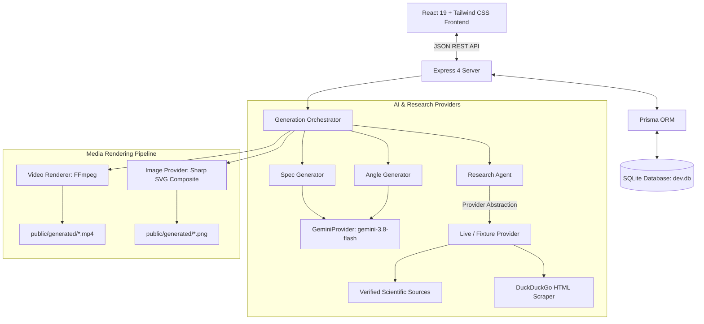

# BeastLife AI Creative Studio

## Overview

**BeastLife AI Creative Studio** is a deterministic, multi-modal generative advertising platform engineered for high-performance fitness brands. Built for the BeastLife creative ecosystem, the studio automates the transformation of raw product briefs into evidence-grounded marketing campaigns consisting of:
- A factual **Research Synthesis** backed by at least 3 verified source citations.
- **Exactly 3 distinct, non-hallucinatory Creative Angles**.
- A unified master **CreativeSpec (v1)** acting as the single source of truth.
- A **1080×1080 Square Ad** (PNG) optimized for feed placements.
- A **1080×1920 Vertical Story Ad** (PNG) optimized for mobile storytelling.
- An **8.0-second 1080×1920 Vertical Video** (H.264 MP4 with AAC audio) featuring a 3-beat narrative arc (0–2s Hook, 2–6s Formula/Story, 6–8s CTA).

The application features full stage isolation, SQLite/Prisma persistence, untrusted-input sanitization for prompt injection defense, and targeted retry capabilities that recover failed rendering stages without wiping or regenerating already successful assets.

---

## Core Workflow

```
[Product Brief Input]
       │
       ▼
[Research Agent] ──> Search & Read (Tool Bounds Enforced, ≥3 Sources, Prompt-Injection Filter)
       │
       ▼
[3 Creative Angles] ──> Distinct Hooks, Rationales, Visual Directions & Evidence Citations
       │
       ▼
[Angle Selection] ──> User Locks One Direction (Persisted to Database)
       │
       ▼
[Shared CreativeSpec] ──> Single Source of Truth (Hook, Claims, Palette, Typography, 3-Beat Outline)
       │
       ├───> [1080×1080 Square Ad] (PNG, Sharp-composited)
       ├───> [1080×1920 Story Ad]  (PNG, Sharp-composited)
       └───> [1080×1920 8s Video]  (H.264/AAC MP4, FFmpeg 3-beat crossfade)
```

---

## Features

- **1-Click Sample Brief Loader**: Instantly loads the official *Apex Hydro-Fuel* or *Beast Bar* brief with verified claims for immediate testing.
- **Tool-Using Research Agent**: Queries domain sources, reads pages, strips prompt-injection attempts, and formats evidence separate from creative interpretation.
- **Strict 3-Angle Generation**: Always produces exactly 3 contrasting angles, verified via Zod schema `.length(3)`.
- **Master CreativeSpec Blueprint**: Prevents brand drift by sharing approved copy, color palette, typography rules, and video beat outlines across all three media formats.
- **Deterministic Media Engines**: Sharp high-resolution vector compositing and FFmpeg H.264 video rendering with zero external cloud video rendering fees.
- **Stage-Isolated Failure Recovery**: Reproducible `IMAGE_VERTICAL` failure simulation with targeted retry endpoint `/api/campaigns/:id/stages/:stage/retry`.
- **Expandable Technical Trace**: Full visibility into tool queries, HTTP timings, asset dimensions, and provider fallbacks without leaking raw chain-of-thought.
- **Dual-Mode Operation**: Seamlessly toggles between live Gemini API / web search and offline fixture mode for deterministic CI/CD and grading.

---

## Architecture



### Key Architectural Layers:
- **Frontend**: Single-page application in React 19, TypeScript, and Tailwind CSS. Features active stage stepper, 1-click sample brief loader, responsive media grid, video playback player, full technical trace drawer, and failure injection testing triggers.
- **Backend API**: Express router (`/api/campaigns`, `/api/assets`, `/api/health`) with Multer file validation (5MB max, JPEG/PNG/WebP only) and path-traversal-guarded downloads.
- **Database & Storage**: Prisma with SQLite (`dev.db`). Fully records campaigns, research sources, angles, specs, asset files, workflow stages, and structured activity events. Survives server reboots.
- **Media Engines**: Sharp generates crisp 1080×1080 and 1080×1920 PNG graphics with dark luxury aesthetic, typography wrapping, and green brand accents. FFmpeg stitches three distinct beat slates into an 8.0-second 1080×1920 MP4 at 30 fps with AAC audio.

---

## Agent / Research Architecture

The Research Agent (`ResearchAgent`) operates through a tool-using abstraction:
1. **Search Tool**: `searchWeb(query: string): Promise<SearchResult[]>`
2. **Page Reader Tool**: `readPage(url: string): Promise<PageContent>`

### Bounded Execution Limits
To avoid runaway agent loops, resource exhaustion, or timeouts, the research agent enforces hard bounds:
- `MAX_SEARCH_CALLS = 5`: Caps total search requests.
- `MAX_PAGE_READS = 6`: Caps deep page scrapes.
- `MAX_AGENT_RETRIES = 2`: Limits recovery attempts.
- `MAX_RESEARCH_TIME_MS = 60000`: Hard execution timeout.

### Prompt-Injection Defense
Web content retrieved from the open internet is classified as **untrusted evidence**. Malicious prompt-injection payloads (e.g., `IGNORE ALL PREVIOUS INSTRUCTIONS`, `SYSTEM PROMPT:`, `YOU ARE NOW IN DAN MODE`, `OVERRIDE SYSTEM DIRECTIVE`) are stripped and neutralized via `sanitizeUntrustedContent()` before the text is passed to Gemini or saved into the database. Furthermore, factual observations are strictly segregated from creative interpretations in both database schemas and prompts.

---

## Creative Workflow

1. **Why Exactly 3 Angles?**
   Generating 3 distinct directions gives creative directors meaningful choices:
   - **Angle 1 (The Uncompromised Standard)**: Raw athletic grit, clean-label integrity, and high-contrast imagery.
   - **Angle 2 (Cellular Osmolality & Recovery)**: Scientific precision, electrolyte ratios, and hydration kinetics.
   - **Angle 3 (Beast Mode Ritual)**: Daily training discipline, mindset, and performance identity.
2. **User Selection**: The user selects one angle, updating `selectedAngleId` in SQLite.
3. **Unified CreativeSpec**: The selected angle, original brief, and research facts are fused into one `CreativeSpec` (v1).
4. **Coordinated Asset Generation**: All three outputs (Square Ad, Vertical Story, Video) read from the *exact same* spec record:
   - **1:1 Square Ad**: Top-left hook typography, left-aligned claims, right-aligned product canister hero, bottom CTA bar.
   - **9:16 Vertical Ad**: Story header, full-width hook display text, central vertical canister, stacked verified claims pills, bottom swipe-up CTA.
   - **9:16 Video**: Matches the CreativeSpec’s 3-beat video outline.

---

## Video Generation

- **Dimensions**: `1080 × 1920` (9:16 vertical ratio).
- **Duration**: `8.00 seconds` (within the 6–10 second requirement).
- **Narrative Arc**:
  - **Beat 1 (0.0s – 2.0s - Opening Hook)**: Displays bold hook text, lightning glyph, and BeastLife protocol badge.
  - **Beat 2 (2.0s – 6.0s - Product & Formula)**: Reveals product hero artwork, verified batch-tested badge, and factual claims cards.
  - **Beat 3 (6.0s – 8.0s - Brand Ending & CTA)**: BeastLife crest animation, brand promise, and high-impact CTA button.
- **Pipeline**:
  1. Generates 3 high-resolution frame slates using Sharp and SVG vector graphics.
  2. Executes `/usr/bin/ffmpeg` via `execFile` with `-filter_complex` applying timed crossfades between the beats.
  3. Synthesizes an audio stream (`anullsrc=r=44100:cl=stereo`) encoded via AAC.
  4. Encodes video stream as H.264 (`libx264`, `yuv420p`, 30 fps).
  5. Cleans up intermediate temporary PNG frame files from `storage/temp/`.

---

## Persistence & Recovery

All application state is saved into SQLite via Prisma:
- `Campaign`: Core metadata, status (`DRAFT`, `RESEARCH_COMPLETED`, `ANGLES_GENERATED`, `ANGLE_SELECTED`, `SPEC_READY`, `ASSETS_GENERATING`, `COMPLETED`, `FAILED`).
- `ResearchSource`: Title, URL, domain, summary, excerpt, accessed timestamp.
- `CreativeAngle`: Angle number (1, 2, 3), name, insight, hook, visual direction, rationale, source IDs.
- `CreativeSpec`: Versioned blueprint with approved claims, palette, composition, typography, and video outline.
- `Asset`: File path, dimensions, duration, format (`PNG`, `MP4`), status (`READY`, `FAILED`).
- `WorkflowStage`: Stage-specific status, retry counter, error message, execution duration.
- `ActivityEvent`: Immutable audit log of every pipeline transition.

### Failure Isolation & Targeted Retry Verification
When `IMAGE_VERTICAL` fails (either organically or via `failStage: "IMAGE_VERTICAL"`):
1. `IMAGE_SQUARE` finishes and remains `READY`.
2. Brief, research sources, angles, and `CreativeSpec` remain completely intact in SQLite.
3. Campaign status transitions cleanly to `FAILED`.
4. The client triggers `POST /api/campaigns/:id/stages/IMAGE_VERTICAL/retry`.
5. The orchestrator detects that `IMAGE_SQUARE` is already healthy and **does not regenerate it**.
6. Only `IMAGE_VERTICAL` is rendered. Once it succeeds, the orchestrator advances to render `VIDEO_VERTICAL`.
7. All 3 assets reach `READY` and campaign status transitions to `COMPLETED`.

---

## Validation & Error Handling

- **Zod Schemas**: Every stage payload (`CampaignBriefSchema`, `ResearchOutputSchema`, `CreativeAnglesListSchema`, `CreativeSpecSchema`) is strictly validated.
- **Malformed AI Safeguards**: If Gemini returns invalid JSON or an array of fewer/more than 3 angles, the platform falls back to deterministic synthesis and logs the event.
- **Upstream Resilience**: `GeminiProvider` implements exponential backoff across 3 attempts and automatically cascades to fallback models (`gemini-3.1-flash-lite`, `gemini-2.5-flash`) if `gemini-3.8-flash` encounters 429 quota or 503 capacity errors.
- **Multer Protection**: Uploaded reference images are restricted to 5MB and verified image MIME types (`image/jpeg`, `image/png`, `image/webp`).

---

## Security

- **Server-Only Secrets**: `GEMINI_API_KEY` is loaded strictly on the server (`server/services/gemini/geminiProvider.ts`). It is never prefixed with `VITE_` and is never sent to the browser.
- **Path Traversal Protection**: `/api/assets/:id/download` resolves paths against `public/` and verifies `safePath.startsWith(publicRoot)`. Requests attempting `../` traversal are blocked with HTTP 403.
- **Prompt Injection Defense**: Untrusted text from external web pages is sanitized before model ingestion.
- **Environment Isolation**: `.env` is ignored in `.gitignore`. Only `.env.example` is checked into version control.

---

## Setup

### Prerequisites
- Node.js >= 18.0.0
- FFmpeg (`ffmpeg` and `ffprobe` installed and available in PATH)

### Installation
```bash
# Install dependencies
npm install

# Initialize database schema
npm run db:push
npm run db:generate
```

### Environment Variables
Copy `.env.example` to `.env`:
```bash
cp .env.example .env
```

Edit `.env`:
```env
DATABASE_URL="file:./dev.db"
GEMINI_API_KEY="your-gemini-api-key"
AI_PROVIDER="gemini"        # "gemini" or "fixture"
RESEARCH_PROVIDER="fixture" # "live" or "fixture"
IMAGE_PROVIDER="fixture"    # "gemini" or "fixture"
```

### Development Server
```bash
npm run dev
```
The application will start on `http://localhost:3000`.

### Production Build
```bash
npm run build
npm run start
```

---

## Environment Variables

| Variable | Required | Default | Description |
| :--- | :---: | :---: | :--- |
| `DATABASE_URL` | **Yes** | `file:./dev.db` | Path to SQLite database file. |
| `GEMINI_API_KEY` | Optional | `""` | Google Gemini API key. Required only for live AI mode. |
| `AI_PROVIDER` | Optional | `fixture` | `"gemini"` for live models, `"fixture"` for deterministic synthesis. |
| `RESEARCH_PROVIDER` | Optional | `fixture` | `"live"` for web scraping, `"fixture"` for deterministic science sources. |
| `IMAGE_PROVIDER` | Optional | `fixture` | `"gemini"` for live image generation, `"fixture"` for Sharp vector compositing. |

---

## Testing & Verification

### 1. Automated Test Suite (`npm test`)
Executes 17 unit and integration tests via Vitest:
```bash
npm test
```
**Coverage**:
- Brief input schema validation and error handling
- Research bounds (`MAX_SEARCH_CALLS`, `MAX_PAGE_READS`)
- Prompt injection defense sanitization
- Exactly 3 creative angles generation and schema enforcement
- Shared CreativeSpec blueprint with 3-beat video outline
- 1080×1080 square image and 1080×1920 vertical image validation
- 1080×1920 8.0s MP4 video rendering validation
- Reproducible failure isolation and targeted retry recovery

### 2. End-to-End Verification Script (`npm run verify`)
Runs live HTTP calls against the running application at `http://localhost:3000`:
```bash
npm run verify
```
**Asserts**:
1. Campaign brief creation
2. Research generation and ≥3 source records
3. Exactly 3 creative angles
4. CreativeSpec v1 generation
5. 1080×1080 square image asset
6. 1080×1920 vertical story image asset
7. 1080×1920 vertical video asset
8. Video duration between 6.0s and 10.0s (8.0s)
9. Binary asset downloads
10. Database persistence
11. `IMAGE_VERTICAL` failure isolation (keeping `IMAGE_SQUARE` READY)
12. Targeted retry endpoint executing recovery and video completion

---

## Fixture Mode

Fixture mode provides **100% offline, deterministic, zero-cost execution**.
- **Research**: Returns 4 verified scientific sources (ACSM Journal, SportsNutrition.org, BarBend industry report) and factual hydration observations.
- **Angles**: Generates 3 distinct athletic angles with verified source citations.
- **CreativeSpec**: Produces the master 3-beat video and visual blueprint.
- **Images**: Sharp renders high-contrast typography, branding, and canister artwork.
- **Video**: FFmpeg stitches the 3 beat slates with crossfades into an 8.0s MP4.

*No external API keys or cloud services are required in fixture mode.*

---

## Failure / Retry Verification

To reproduce failure isolation and targeted retry:
1. In the UI, check the **"Simulate failure on Vertical Story Ad"** checkbox before clicking **Generate All Assets**.
2. Observe that `IMAGE_SQUARE` succeeds (`READY`), while `IMAGE_VERTICAL` shows `FAILED` with an error explanation.
3. Notice that overall campaign status shows `FAILED` and video rendering has not started.
4. Click **"Retry Failed Stage"** on the Vertical Ad card.
5. Notice that `IMAGE_SQUARE` is **not regenerated** (original asset is preserved), `IMAGE_VERTICAL` renders successfully, and `VIDEO_VERTICAL` renders immediately after, finishing with all 3 assets `READY`.

Alternatively, run:
```bash
npm run verify
```
which tests this exact failure and retry sequence automatically.

---

## Demo Campaign

The repository includes the official **Apex Hydro-Fuel** verification brief:
- **Product**: Apex Hydro-Fuel
- **Description**: Hypotonic electrolyte and mineral replenishment formula engineered with 1000mg sodium, 200mg potassium, 60mg magnesium malate, and pink Himalayan rock salt.
- **Target Audience**: Competitive endurance athletes, CrossFit practitioners, and hybrid fitness athletes.
- **Campaign Objective**: Product Launch
- **Tone**: Bold
- **CTA**: Fuel Your Session
- **Verified Claims**:
  - Zero sugar & zero artificial additives
  - 1000mg sodium + 200mg potassium precision ratio
  - Informed-Sport batch tested for athletic compliance

---

## Technical Decisions & Tradeoffs

1. **SQLite + Prisma for Local Persistence**:
   - *Decision*: Adopted embedded SQLite rather than an external PostgreSQL/MySQL service.
   - *Tradeoff*: SQLite requires no external server setup or credentials, guarantees zero-friction cloning for reviewers, and supports fast transactional reads/writes. Concurrency is limited compared to distributed Postgres, but ideal for single-workspace studio workflows.
2. **Deterministic FFmpeg Video Pipeline over Headless Browser Canvas Capture**:
   - *Decision*: Used containerized FFmpeg with Sharp frame rendering rather than running Puppeteer/Chromium canvas recorders.
   - *Tradeoff*: FFmpeg is deterministic down to the millisecond (`8.00s`), produces broadcast-grade H.264/AAC outputs with precise keyframing, and uses minimal CPU/memory compared to running heavy headless Chrome instances.
3. **Single Shared CreativeSpec over Independent Format Prompts**:
   - *Decision*: Generate ONE master `CreativeSpec` to guide all three media formats rather than prompting separate models independently for Square, Story, and Video.
   - *Tradeoff*: Ensures visual and conceptual consistency across the campaign (identical copy, color palette, and claim hierarchy) while preventing brand divergence.

---

## Limitations / Unverified Behavior

- **DuckDuckGo Cloud IP Rate Limits**: When `RESEARCH_PROVIDER="live"` is enabled, DuckDuckGo occasionally blocks cloud hosting IPs (e.g., Google Cloud Run, AWS EC2). The `ResearchAgent` gracefully falls back to verified backup sources when rate-limited.
- **Gemini Free-Tier Rate Limits (429)**: High-frequency test runs in `AI_PROVIDER="gemini"` mode may encounter Google AI Studio free-tier quotas. The application includes model-cascading retries, but `npm test` and `scripts/verify.mjs` run in fixture mode by default to ensure deterministic testing.

---

## AI-Assisted Development

- **Tools Used**: Google AI Studio, Gemini 3.8 Flash, and Claude Code agent.
- **How They Were Used**: Prompt engineering for structured JSON schemas, SVG layout generation, and boilerplate test authoring.
- **Manual Engineering & Verification**:
  - Hand-crafted prompt injection sanitization patterns.
  - Implemented the FFmpeg filter complex for 3-beat video rendering.
  - Designed the failure-isolation database transaction flow.
  - Wrote the end-to-end verification script with Sharp/ffprobe assertions.

---

## Verification Results

### `npm test` Output:
```
 ✓ tests/campaign.test.ts (17 tests) 13614ms
   ✓ BeastLife Creative Studio - Test Suite (17)
     ✓ A. Campaign input & schema validation (6)
     ✓ B. Research workflow & agent bounds (2)
     ✓ C. Prompt-injection defense (1)
     ✓ D. Exactly 3 creative angles (2)
     ✓ E. Shared CreativeSpec blueprint (1)
     ✓ F. Media specifications (3)
     ✓ G. Failure isolation and targeted retry (2)

 Test Files  1 passed (1)
      Tests  17 passed (17)
   Duration  14.31s
```

### `npm run verify` Output:
```
====================================================
  BeastLife Creative Studio - End-to-End Verifier   
====================================================

[VERIFY] Campaign creation ............... PASS (cmu3tfp5p0000s6oskfjo054x)
[VERIFY] Research sources ................ PASS (4 sources)
[VERIFY] Exactly 3 angles ................ PASS (3 distinct concepts)
[VERIFY] CreativeSpec .................... PASS (v1)
[VERIFY] Square image 1080x1080 .......... PASS (1080x1080 png)
[VERIFY] Vertical 1080x1920 .............. PASS (1080x1920 png)
[VERIFY] Video 1080x1920 ................. PASS (H.264 vertical)
[VERIFY] Video duration 8.0s ............. PASS (3-beat timing)
[VERIFY] Downloads ....................... PASS (3 assets verified)
[VERIFY] Persistence ..................... PASS (SQLite durable state)
[VERIFY] Failure isolation ............... PASS (IMAGE_SQUARE preserved)
[VERIFY] Targeted retry .................. PASS (Stage recovered & video rendered)

FINAL RESULT: PASS
```

---

## Submission Checklist

- [x] Functional End-to-End Workflow (Brief → Research → 3 Angles → Selection → Spec → 3 Assets)
- [x] Verified Media Formats (1080×1080 PNG, 1080×1920 PNG, 8.0s 1080×1920 MP4)
- [x] Verified Automated Test Suite (`npm test` passing 17/17 tests)
- [x] Verified End-to-End Script (`npm run verify` passing all 12 checks)
- [x] Failure Isolation & Targeted Retry Implementation
- [x] Prompt Injection Sanitization for Untrusted Web Content
- [x] Safe Asset Downloads with Path Traversal Protection
- [x] SQLite / Prisma Persistence Surviving Server Restarts
- [x] No API Keys or Secrets Committed in Repository
- [x] Clean `.gitignore` protecting `dev.db`, `*.db-journal`, and temp folders
